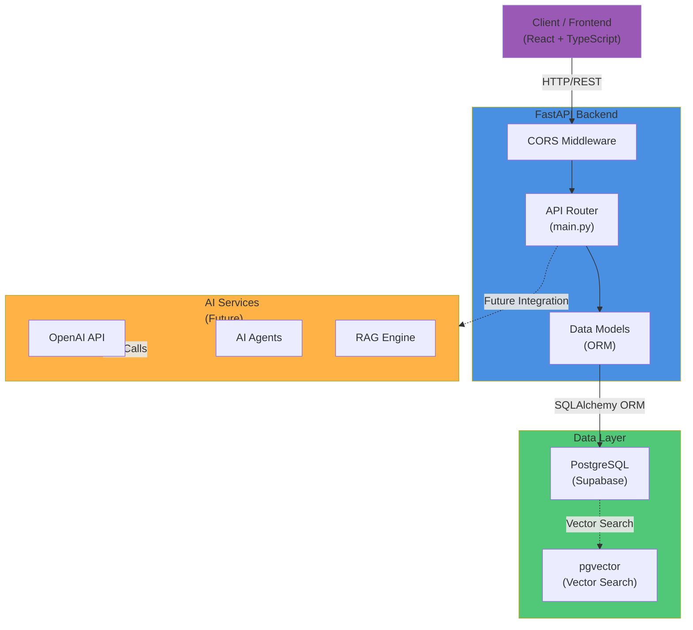
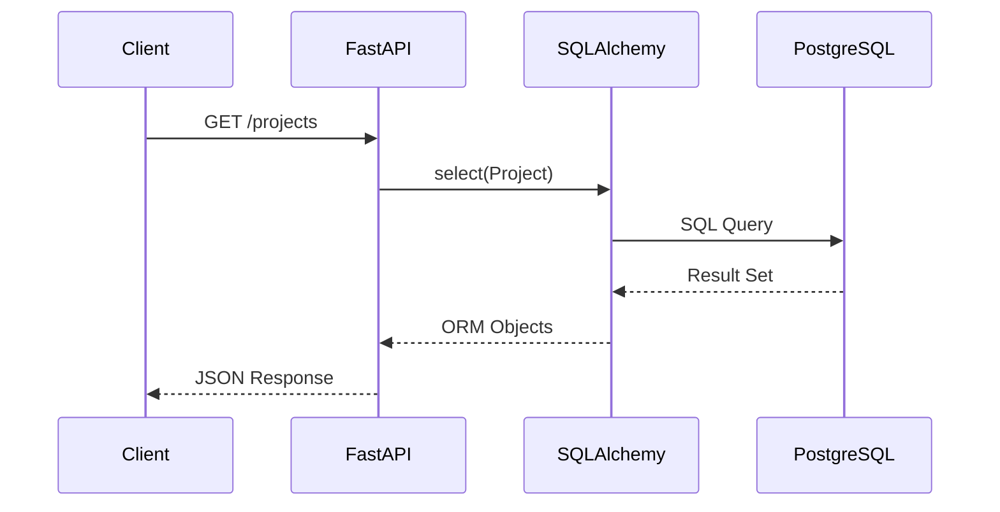
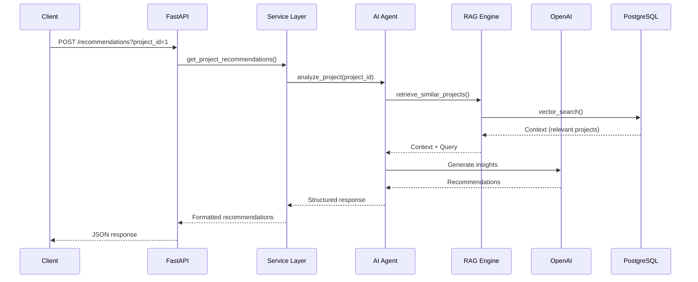
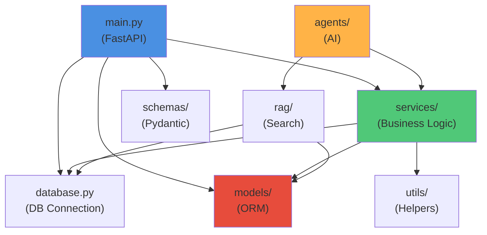

# System Architecture

## System Overview

StratOS AI follows a modern three-tier architecture combining REST API with AI capabilities. The system is designed for scalability, maintainability, and future expansion with AI agents and workflow automation.

### Current Architecture Diagram



---

## Technology Stack

### Core Technologies

| Layer | Technology | Version | Purpose |
|-------|-----------|---------|---------|
| **Runtime** | Python | 3.12+ | Backend language |
| **Web Framework** | FastAPI | 0.100+ | REST API framework |
| **Server** | Uvicorn | 0.23+ | ASGI server |
| **Database** | PostgreSQL | 15+ | Primary relational database |
| **Vector DB** | pgvector | 0.5+ | Vector search capabilities |
| **ORM** | SQLAlchemy | 2.0+ | Object-relational mapping |
| **AI** | OpenAI API | Latest | Language models and embeddings |

### Development Stack

| Tool | Purpose |
|------|---------|
| **pip** | Python package management |
| **python-dotenv** | Environment variable management |
| **psycopg2** | PostgreSQL database adapter |
| **uvicorn** | ASGI server for FastAPI |

### Frontend Stack
- **React 19**: UI framework — ✅ Implemented
- **TypeScript**: Type-safe JavaScript — ✅ Implemented
- **Vite**: Build tool / dev server — ✅ Implemented
- **React Router**: Client-side page navigation — ✅ Implemented
- **Tailwind CSS v4**: Styling (via `@tailwindcss/vite`) — ✅ Implemented
- **State management (Redux/Zustand)**: Not yet needed — local component state + `fetch` for now

### Infrastructure
- **Supabase**: PostgreSQL hosting + pgvector + Auth (planned)
- **GitHub**: Version control and CI/CD
- **Docker**: Containerization (planned)
- **AWS/GCP**: Cloud deployment (planned)

---

## Design Patterns

### Current Patterns

#### 1. **MVC (Model-View-Controller)**
- **Models**: SQLAlchemy ORM models (Project, Engineer)
- **Views**: FastAPI route handlers (endpoints)
- **Controller**: Business logic in route handlers

#### 2. **Dependency Injection**
- Database session injection in route handlers
- SQLAlchemy `Session` as dependency

#### 3. **Repository Pattern** (Future)
- Planned abstraction layer for data access
- Enables easier testing and database switching

#### 4. **Service Layer** (Adopted for new modules)
- Separate business logic from route handlers
- Reusable business logic components
- **Implemented** by the Document Management module: `routers/documents.py` handles
  HTTP only, `services/document_service.py` owns the rules and imports no FastAPI,
  so the same logic can be reused by a background worker or the AI ingestion pipeline.
  Services raise domain exceptions (`services/exceptions.py`); routers map them to
  status codes. Older Project/Engineer endpoints remain inline (see ADR-P02).

#### 5. **Storage Abstraction (Strategy Pattern)**
- `storage/base.py` defines a four-method blob interface; `storage/local.py` implements
  it on the local filesystem and `get_document_storage()` picks the backend from config
- Document rows store `storage_backend` + `storage_key`, never a filesystem path, so an
  S3/Azure Blob backend can be added — and existing rows migrated per-object — without
  schema, API or service changes

### Architectural Patterns

#### 1. **Layered Architecture**
```
┌─────────────────┐
│   Presentation  │ (API Routes)
├─────────────────┤
│   Business      │ (Services, Agents)
├─────────────────┤
│   Data Access   │ (ORM, Repositories)
├─────────────────┤
│   Data Storage  │ (PostgreSQL, pgvector)
└─────────────────┘
```

#### 2. **CORS Middleware Pattern**
- All origins allowed (development configuration)
- Future: Restrict to known domains in production

---

## API Architecture

### REST API Design

#### API Style
- RESTful API following HTTP conventions
- JSON request/response format
- Stateless request handling

#### Current Endpoints

```
GET    /                              → Home message
GET    /projects                      → Retrieve all projects
GET    /projects/{id}                 → Get project details
POST   /projects                      → Create new project
PUT    /projects/{id}                 → Update project (full replacement)
PATCH  /projects/{id}/status          → Change project status (soft lifecycle)
GET    /engineers                     → Retrieve all engineers
GET    /engineers/{id}                → Get engineer details
POST   /engineers                     → Create new engineer
PUT    /engineers/{id}                → Update engineer (full replacement)
PATCH  /engineers/{id}/status         → Change engineer status (soft delete alternative)
GET    /projects/{project_id}/engineers → Engineers assigned to a project
GET    /dashboard/summary             → Portfolio + team headline counts
GET    /dashboard/project-status      → Project counts grouped by status (chart)
GET    /dashboard/recent-projects     → 5 most recently created projects
GET    /dashboard/recent-engineers    → 5 most recently added engineers
GET    /db-test                       → Database connectivity test
```

Neither engineers nor projects are hard-deleted — the `PATCH .../status` endpoints are the supported way to retire a record, preserving historical staffing and portfolio data.

#### Future Endpoints

```
POST   /projects            → Create new project
GET    /projects/{id}       → Get project details
PUT    /projects/{id}       → Update project
DELETE /projects/{id}       → Delete project

POST   /assignments         → Assign engineer to project
DELETE /assignments/{id}    → Remove assignment

GET    /analytics/portfolio → Portfolio analytics
GET    /analytics/risks     → Risk assessment
POST   /recommendations     → AI-powered recommendations
```

#### Response Format
```json
// Single Resource
{
  "id": 1,
  "name": "CloudSync Platform",
  "customer": "TechCorp Inc.",
  "status": "active",
  "budget": 500000.0
}

// Multiple Resources
[
  {
    "id": 1,
    ...
  },
  {
    "id": 2,
    ...
  }
]
```

---

## Authentication & Authorization

### Current State
- **No authentication** implemented (open API)
- **No authorization** checks

### Future Implementation (Planned)

#### Authentication Methods
1. **API Keys**: For service-to-service communication
2. **JWT Tokens**: For user authentication
3. **OAuth 2.0**: For third-party integrations
4. **SSO**: Single Sign-On via Supabase (planned)

#### Authorization Model
```
Roles:
├── Admin: Full system access
├── Portfolio Manager: Portfolio-level access
├── Project Manager: Project-level access
└── Team Member: Own projects and assignments only

Resources:
├── Projects (view/create/edit/delete)
├── Engineers (view/manage assignments)
├── Reports (view analytics)
└── Settings (admin only)
```

---

## Data Flow

### Current Request Flow



### Future AI Request Flow



---

## Deployment Architecture

### Current Deployment

```
┌─────────────────────────────┐
│   Development Environment   │
│  (localhost:8000 / Codespace)
│                             │
│  ┌───────────────────────┐  │
│  │   FastAPI (Uvicorn)   │  │
│  │    running on :8000   │  │
│  └───────────────────────┘  │
└──────────────┬──────────────┘
               │
               │ HTTP over SSL
               │
        ┌──────▼────────┐
        │   Supabase    │
        │  PostgreSQL   │
        │   (Cloud)     │
        └───────────────┘
```

### Future Deployment (Planned)

```
┌──────────────────────────────────────────┐
│         Production Environment           │
│                                          │
│  ┌────────────────────────────────────┐  │
│  │        Load Balancer / CDN         │  │
│  └─────────────┬──────────────────────┘  │
│                │                         │
│  ┌─────────────▼──────────────────────┐  │
│  │   FastAPI Instances (Replicas)     │  │
│  │   ├── Instance 1 (Container)       │  │
│  │   ├── Instance 2 (Container)       │  │
│  │   └── Instance N (Container)       │  │
│  └─────────────┬──────────────────────┘  │
│                │                         │
│  ┌─────────────▼──────────────────────┐  │
│  │    PostgreSQL (Managed Cloud)      │  │
│  │    ├── Primary Instance            │  │
│  │    └── Read Replicas               │  │
│  └────────────────────────────────────┘  │
│                                          │
│  ┌────────────────────────────────────┐  │
│  │    CI/CD Pipeline (GitHub Actions) │  │
│  │    ├── Test                        │  │
│  │    ├── Build                       │  │
│  │    └── Deploy                      │  │
│  └────────────────────────────────────┘  │
└──────────────────────────────────────────┘
```

---

## Scalability Strategy

### Horizontal Scaling
1. **API Layer**: Multiple FastAPI instances behind load balancer
2. **Database**: PostgreSQL read replicas for read-heavy queries
3. **Caching**: Redis for session and query result caching (planned)
4. **Message Queue**: Background job processing (planned)

### Vertical Scaling
1. **Database**: Increase instance size for PostgreSQL
2. **API Server**: Increase compute resources
3. **Monitoring**: Performance metrics to identify bottlenecks

### Optimization Techniques
1. **Connection Pooling**: SQLAlchemy connection pooling
2. **Query Optimization**: Indexed queries, efficient joins
3. **Caching Strategy**: API response caching (planned)
4. **Async Processing**: Async routes for long-running operations (planned)

---

## Performance Considerations

### Current Optimizations
- SQLAlchemy ORM for efficient database queries
- CORS middleware for cross-origin requests
- Connection reuse with SQLAlchemy sessions

### Planned Optimizations
1. **Database Indexes**: Strategic indexing on frequently queried columns
2. **Query Optimization**: Batch queries, lazy loading strategies
3. **Caching Layers**: Redis for hot data
4. **Pagination**: Limit result sets for large datasets
5. **Async API**: Async/await for I/O operations
6. **Compression**: gzip compression for API responses

### Performance Targets
- **API Response Time**: < 200ms (p95)
- **Database Query Time**: < 100ms
- **Throughput**: 1000+ requests/second
- **Uptime**: 99.5%+

---

## Security Architecture

### Current Security Implementation
- CORS middleware (all origins allowed - development only)
- Environment-based secrets management (.env)
- No authentication/authorization
- **File upload hardening** (Document Management module):
  - Allow-list on extension *and* Content-Type, plus a magic-number check
    (`%PDF-`) so a renamed executable cannot be stored as a "PDF"
  - Size limit enforced while streaming, not from the client's `Content-Length`;
    partial writes are cleaned up
  - Client filenames are never used to build paths — storage keys are
    server-generated UUIDs; the filename is sanitised for display/download only
  - Local storage resolves every key and rejects anything outside the storage root
  - Downloads are served with `X-Content-Type-Options: nosniff` and a quoted,
    RFC 6266-encoded `Content-Disposition`
  - Search input is escaped before use in `ILIKE` patterns; all queries are
    parameterised through SQLAlchemy

### Planned Security Measures

#### 1. **Authentication**
- JWT token-based authentication
- Refresh token rotation
- Session management

#### 2. **Authorization**
- Role-based access control (RBAC)
- Resource-level permissions
- Audit logging for sensitive operations

#### 3. **API Security**
- Rate limiting per IP/user
- Request validation and sanitization
- SQL injection prevention (SQLAlchemy ORM)
- CORS restriction to known domains

#### 4. **Data Security**
- Encryption at rest (database)
- Encryption in transit (TLS/SSL)
- Sensitive data masking in logs
- Data backup and recovery procedures

#### 5. **Infrastructure Security**
- Private subnets for database
- VPC for isolated network
- Security groups and firewall rules
- Secrets management (Vault/Secrets Manager)

#### 6. **Dependency Security**
- Dependency scanning (Dependabot)
- Regular security updates
- Vulnerability assessment

---

## Integration Points

### External Services
- **OpenAI API**: For AI-powered features
- **Supabase**: PostgreSQL database and authentication
- **GitHub**: Version control and CI/CD

### Third-Party Integrations (Planned)
- **Jira**: Project tracking sync
- **Azure DevOps**: Portfolio management
- **Salesforce**: CRM integration
- **Slack**: Notifications and commands
- **Microsoft Teams**: Notifications and integration

### Internal Integrations (Planned)
- **Webhook System**: External system triggers
- **Event Queue**: Async event processing
- **Notification Service**: Email, SMS, push notifications

---

## Module Dependencies

### Current Module Structure

```
backend/app/
├── main.py              # FastAPI application, inline routes (Projects + Engineers + Dashboard), router mounting
├── config.py            # Environment-driven settings (storage backend, upload limits, log level)
├── logging_config.py    # Central logging setup
├── database.py          # Database connection + get_session() request dependency
├── migrate.py           # Idempotent schema migration (adds Project columns)
├── migrate_documents.py # Idempotent schema migration (creates documents table + indexes)
├── purge_documents.py   # Retention job: reclaims blobs of soft-deleted documents
├── seed.py              # Sample data seeding
├── schemas.py           # Pydantic request/response models (Engineer + Project + Document)
├── models/
│   ├── __init__.py      # Shared ORM Base
│   ├── project.py       # Project ORM model
│   ├── engineer.py      # Engineer ORM model
│   └── document.py      # Document ORM model (metadata only; blob lives in storage)
├── routers/
│   └── documents.py     # Document HTTP surface (parsing, status codes, response models)
├── services/
│   ├── exceptions.py    # Domain exceptions, translated to HTTP by the routers
│   └── document_service.py  # Upload validation, hashing, storage orchestration, queries
└── storage/
    ├── base.py          # DocumentStorage interface (save / open / delete / exists)
    ├── local.py         # Local filesystem backend (atomic writes, path-traversal guard)
    └── __init__.py      # get_document_storage() — backend selection from config

frontend/src/
├── main.tsx             # React entry point
├── App.tsx              # Route definitions (React Router)
├── index.css            # Tailwind import + base styles
├── api/
│   ├── client.ts        # fetch wrapper (GET/POST/PUT/PATCH) + error parsing
│   ├── engineers.ts     # getEngineers() → GET /engineers
│   ├── projects.ts      # Project CRUD calls → /projects endpoints
│   ├── documents.ts     # Document upload/list/update/delete + download URL builder
│   └── dashboard.ts     # Dashboard aggregations → /dashboard endpoints
├── components/
│   ├── layout/
│   │   ├── Layout.tsx   # App shell (sidebar + responsive header)
│   │   └── Sidebar.tsx  # Navigation sidebar
│   ├── ui/
│   │   └── Modal.tsx    # Reusable modal dialog (overlay, Esc-to-close)
│   ├── engineers/
│   │   └── StatusBadge.tsx       # Colored engineer status pill
│   ├── projects/
│   │   ├── ProjectStatusBadge.tsx # Colored project status pill
│   │   ├── ProjectFormModal.tsx   # Add / Edit project form
│   │   └── ChangeStatusModal.tsx  # Change project status
│   ├── documents/
│   │   ├── DocumentTypeBadge.tsx   # Colored document type pill
│   │   ├── DocumentUploadModal.tsx # Upload form (file + metadata)
│   │   ├── DocumentEditModal.tsx   # Metadata-only edit form
│   │   └── DeleteDocumentModal.tsx # Delete confirmation
│   └── dashboard/
│       ├── KpiCard.tsx           # Reusable KPI metric card
│       └── ProjectStatusChart.tsx # Horizontal bar chart (validated palette)
├── pages/
│   ├── Dashboard.tsx    # Executive dashboard (KPIs, chart, recent tables)
│   ├── Engineers.tsx    # Live engineer table
│   ├── Projects.tsx     # Full CRUD project management
│   └── Documents.tsx    # Document repository (search, filters, pagination, upload)
└── types/
    ├── engineer.ts      # Engineer / EngineerStatus types
    ├── project.ts       # Project / ProjectStatus / ProjectInput types
    ├── document.ts      # Document / DocumentType / upload + filter types
    └── dashboard.ts     # DashboardSummary / ProjectStatusCount types

Planned Modules:
├── api/                 # API route handlers
│   ├── projects.py
│   ├── engineers.py
│   └── analytics.py
├── services/            # Business logic
│   ├── project_service.py
│   ├── engineer_service.py
│   └── analytics_service.py
├── agents/              # AI Agents
│   ├── project_agent.py
│   ├── risk_agent.py
│   └── recommendation_agent.py
├── rag/                 # RAG Engine
│   ├── retriever.py
│   └── indexer.py
├── core/                # Core utilities
│   ├── config.py
│   └── constants.py
├── utils/               # Utility functions
│   ├── logger.py
│   └── validators.py
├── prompts/             # AI Prompts
│   ├── system_prompts.py
│   └── user_prompts.py
└── tools/               # AI Tools
    ├── project_tools.py
    └── analytics_tools.py
```

### Dependency Graph



---

## Design Decisions

### ADR-001: FastAPI as Web Framework
**Status**: ✅ Implemented

**Rationale**: FastAPI provides high performance, built-in OpenAPI documentation, and excellent async support. Perfect for a modern Python backend.

### ADR-002: SQLAlchemy ORM
**Status**: ✅ Implemented

**Rationale**: Provides database abstraction, type safety, and enables easy model management. Better than raw SQL for maintainability.

### ADR-003: PostgreSQL with pgvector
**Status**: ✅ Implemented

**Rationale**: PostgreSQL offers reliability and pgvector enables vector search for AI features without additional infrastructure.

### ADR-004: Supabase as Database Provider
**Status**: ✅ Implemented

**Rationale**: Managed PostgreSQL service with built-in pgvector, reducing DevOps overhead and enabling rapid development.

### ADR-005: REST API over GraphQL
**Status**: ✅ Implemented

**Rationale**: REST is simpler to implement initially, well-understood by the team, and sufficient for current feature set. GraphQL can be added later.

---

## Future Architectural Improvements

### Short-term (3-6 months)
- [ ] Async request handling for long-running operations
- [ ] API versioning strategy
- [x] Request/response validation schemas (Pydantic) - ✅ Implemented for Engineer endpoints (`app/schemas.py`)
- [ ] Service layer separation
- [ ] Comprehensive error handling

### Medium-term (6-12 months)
- [ ] Multi-tenant support
- [ ] Event-driven architecture for real-time features
- [ ] Message queue (Redis/RabbitMQ) for background jobs
- [ ] GraphQL API as additional query interface
- [ ] Webhook system for external integrations

### Long-term (12+ months)
- [ ] Microservices architecture
- [ ] Serverless components for specific tasks
- [ ] Advanced AI agent orchestration
- [ ] Federated learning for privacy-preserving AI
- [ ] Edge computing for local processing capabilities
