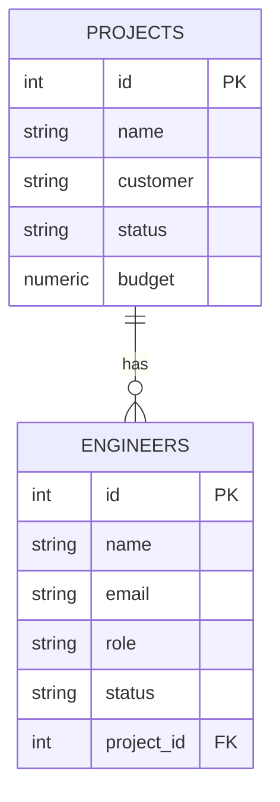
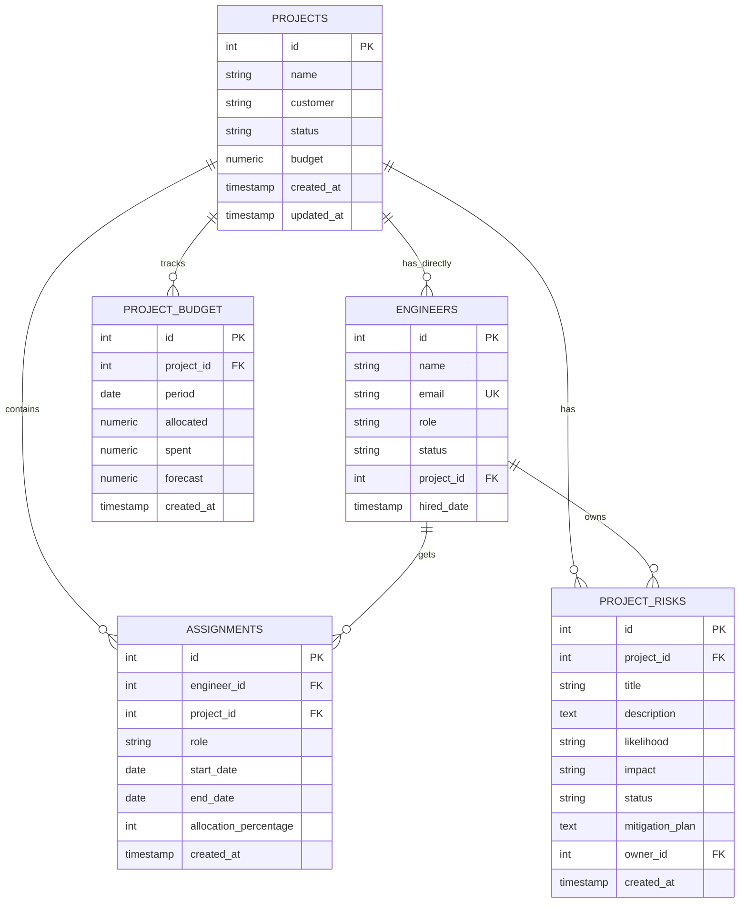

# Database Documentation

## Database Overview

StratOS AI uses PostgreSQL as its primary relational database, hosted on Supabase. The database includes pgvector extension for future vector search capabilities supporting AI-powered features like semantic search and recommendations.

### Database Selection Rationale

| Criteria | PostgreSQL | Benefits |
|----------|-----------|----------|
| **Reliability** | Enterprise-grade | ACID compliance, data integrity |
| **Scalability** | Horizontal & vertical | Read replicas, partitioning |
| **Features** | Rich feature set | JSON, arrays, full-text search, vectors |
| **Community** | Large, active | Extensive documentation, support |
| **Cost** | Open source | No licensing costs, managed services available |
| **Vector Search** | pgvector extension | Native vector search without separate DB |

---

## Connection Information

### Current Configuration
```yaml
Database Type: PostgreSQL 15+
Provider: Supabase (Managed Service)
Host: aws-0-ap-northeast-1.pooler.supabase.com
Port: 5432
Database Name: postgres
SSL: Enabled
Connection Pooling: PgBouncer (Supabase)
```

### Environment Variable
```
DATABASE_URL=postgresql://[username]:[password]@[host]:5432/postgres
```

### Connection Setup (SQLAlchemy)
```python
from sqlalchemy import create_engine

DATABASE_URL = os.getenv("DATABASE_URL")
engine = create_engine(DATABASE_URL)
```

---

## Schema Design

### Entity Relationship Diagram



### Database Tables

#### 1. **Projects Table**

**Purpose**: Stores enterprise project information

**Table Name**: `projects`

```sql
CREATE TABLE projects (
    id SERIAL PRIMARY KEY,
    name VARCHAR NOT NULL,
    customer VARCHAR NOT NULL,
    status VARCHAR NOT NULL,
    budget NUMERIC NOT NULL
);
```

**Columns**:

| Column | Type | Nullable | Constraints | Description |
|--------|------|----------|-------------|-------------|
| `id` | INTEGER | No | PRIMARY KEY | Unique project identifier (auto-increment) |
| `name` | VARCHAR | No | UNIQUE (planned) | Project name / title |
| `customer` | VARCHAR | No | None | Customer or client organization |
| `status` | VARCHAR | No | ENUM (planned) | Project status: active, in_progress, on_hold, completed |
| `budget` | NUMERIC | No | CHECK > 0 (planned) | Project budget in currency units |

**Sample Data**:
```sql
INSERT INTO projects VALUES 
  (1, 'CloudSync Platform', 'TechCorp Inc.', 'active', 500000.00),
  (2, 'DataVault Analytics', 'FinanceFlow Ltd.', 'active', 750000.00),
  (3, 'SecureNet Infrastructure', 'GlobalSecurity Corp.', 'in_progress', 1200000.00);
```

**Indexes (Planned)**:
- `idx_projects_status` on `status` (frequent queries)
- `idx_projects_customer` on `customer` (filtering by customer)

---

#### 2. **Engineers Table**

**Purpose**: Stores engineer/team member information and project assignments

**Table Name**: `engineers`

```sql
CREATE TABLE engineers (
    id SERIAL PRIMARY KEY,
    name VARCHAR NOT NULL,
    email VARCHAR NOT NULL UNIQUE,
    role VARCHAR NOT NULL,
    status VARCHAR NOT NULL,
    project_id INTEGER NOT NULL,
    FOREIGN KEY (project_id) REFERENCES projects(id)
);
```

**Columns**:

| Column | Type | Nullable | Constraints | Description |
|--------|------|----------|-------------|-------------|
| `id` | INTEGER | No | PRIMARY KEY | Unique engineer identifier (auto-increment) |
| `name` | VARCHAR | No | None | Full name of engineer |
| `email` | VARCHAR | No | UNIQUE | Company email address |
| `role` | VARCHAR | No | None | Job title/role: Senior Engineer, Backend Engineer, QA Engineer, etc. |
| `status` | VARCHAR | No | ENUM (planned) | Employment status: active, on_leave, inactive |
| `project_id` | INTEGER | No | FOREIGN KEY → projects(id) | Assigned project identifier |

**Sample Data**:
```sql
INSERT INTO engineers VALUES 
  (1, 'Alice Johnson', 'alice.johnson@stratos.ai', 'Senior Engineer', 'active', 1),
  (2, 'Bob Chen', 'bob.chen@stratos.ai', 'Backend Engineer', 'active', 1),
  ...
  (20, 'Tina Lopez', 'tina.lopez@stratos.ai', 'Security Architect', 'on_leave', 3);
```

**Indexes (Planned)**:
- `idx_engineers_project_id` on `project_id` (filtering by project)
- `idx_engineers_email` on `email` (user lookups)
- `idx_engineers_status` on `status` (availability queries)

---

### Planned Tables

#### 3. **Assignments Table** (Future)
```sql
CREATE TABLE assignments (
    id SERIAL PRIMARY KEY,
    engineer_id INTEGER NOT NULL,
    project_id INTEGER NOT NULL,
    role VARCHAR,
    start_date DATE,
    end_date DATE,
    allocation_percentage INTEGER,
    created_at TIMESTAMP DEFAULT CURRENT_TIMESTAMP,
    FOREIGN KEY (engineer_id) REFERENCES engineers(id),
    FOREIGN KEY (project_id) REFERENCES projects(id),
    UNIQUE(engineer_id, project_id, start_date)
);
```

**Purpose**: Manages engineer assignments with historical tracking and partial allocation

---

#### 4. **Project Risks Table** (Future)
```sql
CREATE TABLE project_risks (
    id SERIAL PRIMARY KEY,
    project_id INTEGER NOT NULL,
    title VARCHAR NOT NULL,
    description TEXT,
    likelihood VARCHAR,
    impact VARCHAR,
    status VARCHAR,
    mitigation_plan TEXT,
    owner_id INTEGER,
    created_at TIMESTAMP DEFAULT CURRENT_TIMESTAMP,
    updated_at TIMESTAMP,
    FOREIGN KEY (project_id) REFERENCES projects(id),
    FOREIGN KEY (owner_id) REFERENCES engineers(id)
);
```

**Purpose**: Track and manage project risks with AI-powered detection

---

#### 5. **Project Budget** (Future)
```sql
CREATE TABLE project_budget (
    id SERIAL PRIMARY KEY,
    project_id INTEGER NOT NULL,
    period DATE,
    allocated NUMERIC,
    spent NUMERIC,
    committed NUMERIC,
    forecast NUMERIC,
    created_at TIMESTAMP,
    FOREIGN KEY (project_id) REFERENCES projects(id)
);
```

**Purpose**: Track project financials and budgets over time

---

#### 6. **Audit Log** (Future)
```sql
CREATE TABLE audit_log (
    id SERIAL PRIMARY KEY,
    table_name VARCHAR,
    record_id INTEGER,
    action VARCHAR,
    old_values JSONB,
    new_values JSONB,
    changed_by INTEGER,
    changed_at TIMESTAMP DEFAULT CURRENT_TIMESTAMP,
    ip_address VARCHAR
);
```

**Purpose**: Complete audit trail for compliance and auditing

---

## Entity Relationship Diagram (Detailed)

### Current Implementation
```
Projects (1) ──── (Many) Engineers
  - Simple one-to-many relationship
  - Each engineer assigned to one project
```

### Planned Enhancement
```
Projects (M)  ────────────  (M) Engineers
         │
         └─── Assignments (Junction Table)
              - Supports multiple assignments per engineer
              - Tracks assignment history
              - Allows partial allocation percentages
```

### Full Schema (With Planned Tables)


---

## Indexing Strategy

### Current Indexes
```sql
-- Implicitly created on primary keys
CREATE INDEX idx_engineers_project_id ON engineers(project_id);
```

### Recommended Indexes (Planned)

**High Priority** (Execute soon):
```sql
-- Frequently filtered columns
CREATE INDEX idx_projects_status ON projects(status);
CREATE INDEX idx_projects_customer ON projects(customer);

-- Foreign key lookups (query optimization)
CREATE INDEX idx_engineers_project_id ON engineers(project_id);
CREATE INDEX idx_engineers_email ON engineers(email);
CREATE INDEX idx_engineers_status ON engineers(status);

-- Composite indexes for common queries
CREATE INDEX idx_engineers_project_status ON engineers(project_id, status);
```

**Medium Priority** (Add after initial load):
```sql
-- Text search (full-text search planned)
CREATE INDEX idx_projects_name_tsvector ON projects 
  USING GIN (to_tsvector('english', name));

CREATE INDEX idx_engineers_name_tsvector ON engineers 
  USING GIN (to_tsvector('english', name));
```

**Low Priority** (Add as needed):
```sql
-- Vector search (pgvector features)
CREATE INDEX idx_project_embeddings ON projects 
  USING ivfflat (embedding vector_cosine_ops);
```

---

## Data Types & Constraints

### Data Type Standards

| Type | Usage | Example |
|------|-------|---------|
| `SERIAL` | Auto-increment integers | Primary keys |
| `VARCHAR` | Variable-length strings | Names, emails, status |
| `TEXT` | Long text content | Descriptions, notes |
| `NUMERIC(precision, scale)` | Financial data | Budgets, costs |
| `TIMESTAMP` | Date and time | Created/updated timestamps |
| `DATE` | Date only | Start/end dates |
| `INTEGER` | Fixed integers | Counts, percentages |
| `JSONB` | JSON data | Flexible attributes |
| `VECTOR` | pgvector format | AI embeddings |

### Constraint Standards

**Current Constraints**:
- PRIMARY KEY: Ensures unique record identification
- FOREIGN KEY: Maintains referential integrity
- NOT NULL: Ensures required data
- UNIQUE: Prevents duplicate emails (planned)

**Planned Constraints**:
```sql
-- Ensure positive budgets
ALTER TABLE projects ADD CONSTRAINT chk_positive_budget 
  CHECK (budget > 0);

-- Ensure valid allocation percentages
ALTER TABLE assignments ADD CONSTRAINT chk_allocation_range 
  CHECK (allocation_percentage > 0 AND allocation_percentage <= 100);

-- Ensure valid status values
ALTER TABLE projects ADD CONSTRAINT chk_valid_status 
  CHECK (status IN ('active', 'in_progress', 'on_hold', 'completed'));
```

---

## Stored Procedures & Functions

### Current State
- No stored procedures implemented yet

### Planned Functions (Trigger Examples)

```sql
-- Auto-update timestamp on record modification
CREATE OR REPLACE FUNCTION update_timestamp()
RETURNS TRIGGER AS $$
BEGIN
    NEW.updated_at = CURRENT_TIMESTAMP;
    RETURN NEW;
END;
$$ LANGUAGE plpgsql;

CREATE TRIGGER set_updated_at_projects
  BEFORE UPDATE ON projects
  FOR EACH ROW
  EXECUTE FUNCTION update_timestamp();

-- Validate assignment dates
CREATE OR REPLACE FUNCTION validate_assignment_dates()
RETURNS TRIGGER AS $$
BEGIN
    IF NEW.end_date IS NOT NULL AND NEW.end_date < NEW.start_date THEN
        RAISE EXCEPTION 'End date cannot be before start date';
    END IF;
    RETURN NEW;
END;
$$ LANGUAGE plpgsql;

CREATE TRIGGER check_assignment_dates
  BEFORE INSERT OR UPDATE ON assignments
  FOR EACH ROW
  EXECUTE FUNCTION validate_assignment_dates();
```

---

## Views

### Current State
- No database views created yet

### Planned Views

```sql
-- Project Summary View
CREATE VIEW project_summary AS
SELECT 
    p.id,
    p.name,
    p.customer,
    p.status,
    p.budget,
    COUNT(e.id) as engineer_count,
    COUNT(CASE WHEN e.status = 'active' THEN 1 END) as active_engineers,
    SUM(CASE WHEN a.allocation_percentage IS NOT NULL 
        THEN a.allocation_percentage ELSE 100 END) as total_allocation
FROM projects p
LEFT JOIN engineers e ON p.id = e.project_id
LEFT JOIN assignments a ON e.id = a.engineer_id
GROUP BY p.id, p.name, p.customer, p.status, p.budget;

-- Engineer Availability View
CREATE VIEW engineer_availability AS
SELECT 
    e.id,
    e.name,
    e.email,
    e.project_id,
    COUNT(a.id) as assignment_count,
    COALESCE(SUM(a.allocation_percentage), 0) as total_allocation,
    CASE 
        WHEN COALESCE(SUM(a.allocation_percentage), 0) >= 100 THEN 'FULL'
        WHEN COALESCE(SUM(a.allocation_percentage), 0) > 0 THEN 'PARTIAL'
        ELSE 'AVAILABLE'
    END as availability_status
FROM engineers e
LEFT JOIN assignments a ON e.id = a.engineer_id
GROUP BY e.id, e.name, e.email, e.project_id;
```

---

## Backup & Recovery Strategy

### Current State
- Supabase automatic backups (managed service)
- Daily snapshots (managed by Supabase)

### Recommended Backup Strategy

**Daily Backups**:
- Automated daily snapshots by Supabase
- 7-day retention

**Weekly Backups**:
- Manual full database dump
- Stored in version control or cloud storage

**Monthly Backups**:
- Long-term archival backup
- Encrypted storage

**Recovery Procedures**:
```bash
# Backup database
pg_dump $DATABASE_URL > backup_$(date +%Y%m%d).sql

# Restore database
psql $DATABASE_URL < backup_20260722.sql

# Point-in-time recovery (Supabase feature)
# Available through Supabase dashboard
```

---

## Performance Optimization

### Current Performance Metrics
- Query response: < 100ms for standard queries
- Connection pooling: Active (Supabase PgBouncer)

### Query Optimization Techniques

#### 1. **Index Usage**
- Ensure WHERE clauses use indexed columns
- Composite indexes for multi-column filters

#### 2. **Join Optimization**
```python
# Efficient: Single query with join
result = session.query(Project).join(Engineer).filter(
    Engineer.status == 'active'
).all()

# Inefficient: N+1 queries
projects = session.query(Project).all()
for project in projects:
    engineers = project.engineers  # Additional query per project
```

#### 3. **Pagination**
```python
# Always use pagination for large datasets
limit = 10
offset = (page - 1) * limit
engineers = session.query(Engineer).limit(limit).offset(offset).all()
```

#### 4. **Projection** (Only fetch needed columns)
```python
# Efficient: Select specific columns
engineers = session.query(
    Engineer.id, 
    Engineer.name, 
    Engineer.email
).all()

# Less efficient: Select entire rows
engineers = session.query(Engineer).all()
```

---

## Query Optimization

### Common Queries Performance

```python
# Query 1: Get all projects (optimized)
projects = session.query(Project).all()
# Expected: ~20ms

# Query 2: Get engineers by project (with join)
engineers = session.query(Engineer)\
    .filter(Engineer.project_id == 1).all()
# Expected: ~15ms (indexed)

# Query 3: Get project summary
summary = session.query(
    Project,
    func.count(Engineer.id).label('engineer_count')
).outerjoin(Engineer).group_by(Project.id).all()
# Expected: ~50ms
```

### Slow Query Logging (Planned)
```yaml
log_min_duration_statement: 100  # Log queries > 100ms
shared_preload_libraries: 'pg_stat_statements'  # Query statistics
```

---

## Migration Strategy

### Current Approach
- Manual schema creation via SQLAlchemy `create_all()`
- Seed data script for initial data load

### Recommended Migration Framework (Planned)

**Alembic Setup**:
```bash
# Initialize Alembic
alembic init alembic

# Create migration
alembic revision --autogenerate -m "Add assignments table"

# Apply migration
alembic upgrade head

# Rollback migration
alembic downgrade -1
```

**Migration Versioning**:
```
versions/
├── 001_initial_schema.py          # Projects, Engineers
├── 002_add_assignments.py         # Assignments table
├── 003_add_project_risks.py       # Risk tracking
├── 004_add_audit_log.py           # Audit trail
└── 005_add_vector_support.py      # Vector embeddings
```

---

## Data Validation Rules

### Application-Level Validation (Planned)

```python
# Pydantic models for validation
from pydantic import BaseModel, EmailStr, Field

class ProjectCreate(BaseModel):
    name: str = Field(..., min_length=1, max_length=255)
    customer: str = Field(..., min_length=1)
    status: Literal["active", "in_progress", "on_hold", "completed"]
    budget: float = Field(..., gt=0)

class EngineerCreate(BaseModel):
    name: str = Field(..., min_length=1, max_length=255)
    email: EmailStr  # Validates email format
    role: str
    status: Literal["active", "on_leave", "inactive"]
    project_id: int  # Foreign key validation
```

---

## Access Control & Permissions

### Current State
- No authentication or authorization implemented

### Planned Access Control Model

```
Admin Role:
├── CREATE/READ/UPDATE/DELETE all tables
├── Manage users and permissions
└── Access all reports

Manager Role:
├── READ all projects and engineers
├── UPDATE projects and assignments
├── CRUD on risk management
└── Access team analytics

Team Member Role:
├── READ own project information
├── READ own assignments
└── SUBMIT status updates

Auditor Role:
└── READ-ONLY access to audit logs and reports
```

---

## Monitoring & Maintenance

### Query Performance Monitoring (Planned)

```sql
-- Identify slow queries
SELECT query, mean_exec_time, calls
FROM pg_stat_statements
WHERE mean_exec_time > 100
ORDER BY mean_exec_time DESC;

-- Monitor table sizes
SELECT schemaname, tablename, pg_size_pretty(pg_total_relation_size(schemaname||'.'||tablename))
FROM pg_tables
WHERE schemaname NOT IN ('pg_catalog', 'information_schema')
ORDER BY pg_total_relation_size(schemaname||'.'||tablename) DESC;

-- Analyze index usage
SELECT schemaname, tablename, indexname, idx_scan
FROM pg_stat_user_indexes
ORDER BY idx_scan;
```

### Maintenance Tasks (Planned)

```sql
-- Regular VACUUM for performance
VACUUM ANALYZE;

-- Rebuild indexes
REINDEX INDEX idx_projects_status;

-- Update table statistics
ANALYZE projects;
ANALYZE engineers;
```

---

## Troubleshooting

### Common Issues

**Issue**: "Relation 'projects' does not exist"
```
Cause: Tables not created
Solution: Run seed.py to initialize schema
```

**Issue**: "Deadlock detected"
```
Cause: Transaction lock conflicts
Solution: Retry transaction, review query order
```

**Issue**: "Out of memory" on large queries
```
Cause: Querying excessive data
Solution: Implement pagination, add WHERE filters
```

### Connection Issues

```python
# Test database connection
def test_connection():
    try:
        with engine.connect() as connection:
            result = connection.execute(text("SELECT 1"))
            print("Connection successful")
    except Exception as e:
        print(f"Connection failed: {e}")
```

### Performance Troubleshooting

```sql
-- Check query execution plan
EXPLAIN ANALYZE
SELECT * FROM engineers 
WHERE project_id = 1 AND status = 'active';

-- Monitor active connections
SELECT * FROM pg_stat_activity;

-- Kill long-running queries
SELECT pg_terminate_backend(pid)
FROM pg_stat_activity
WHERE state = 'active' AND query_start < NOW() - INTERVAL '1 hour';
```
